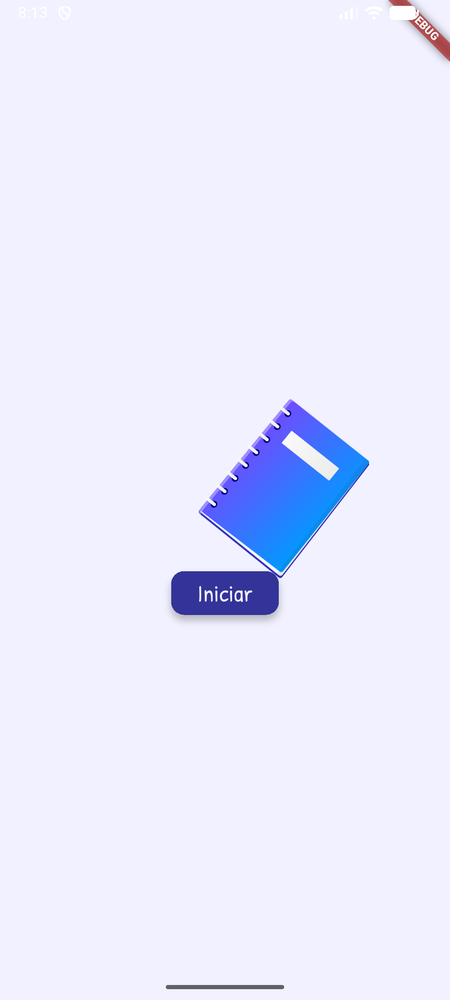
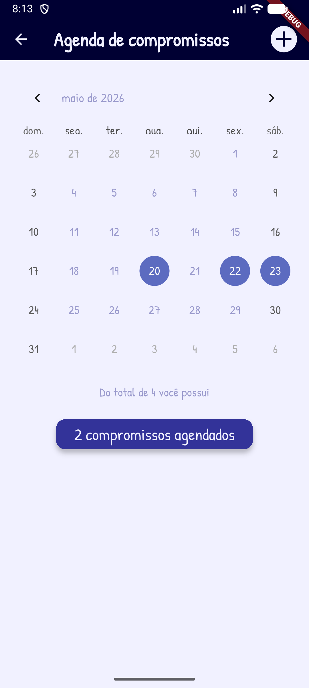
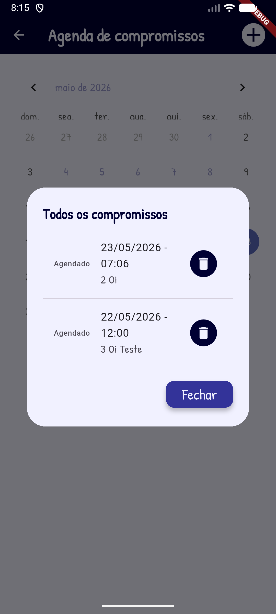
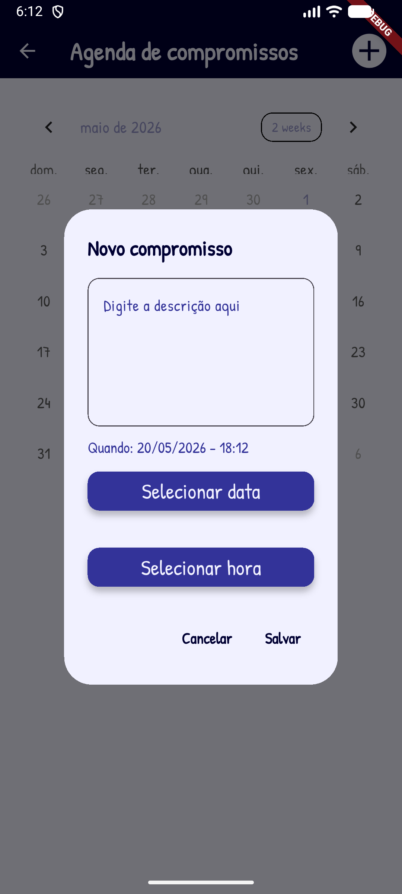
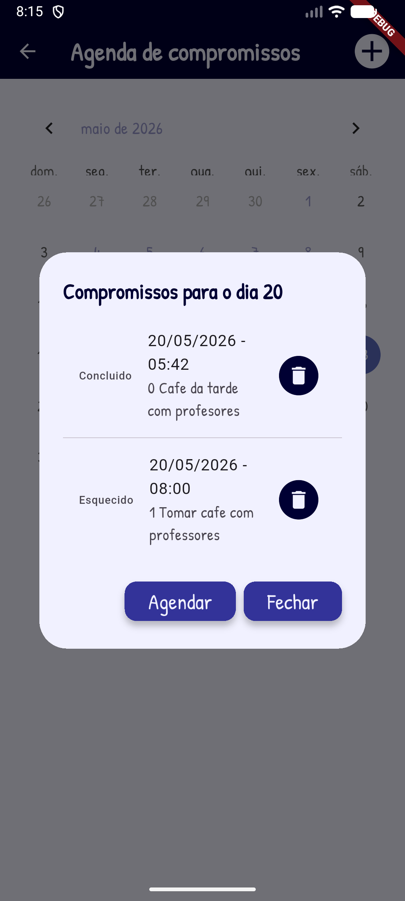
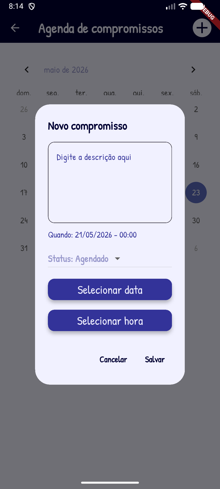
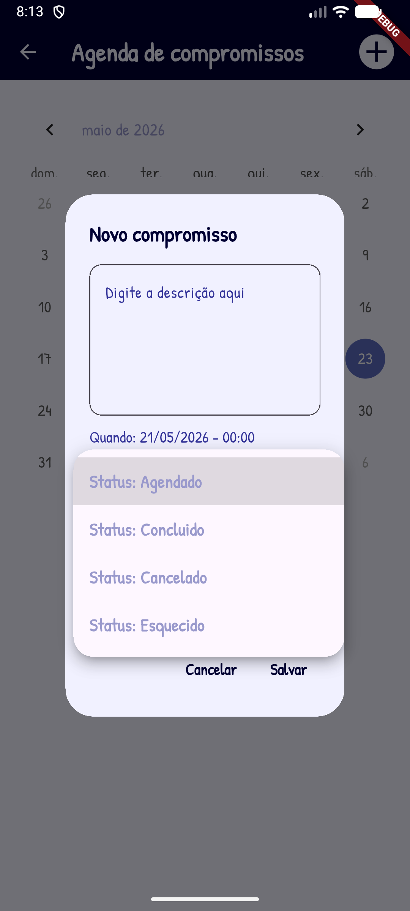
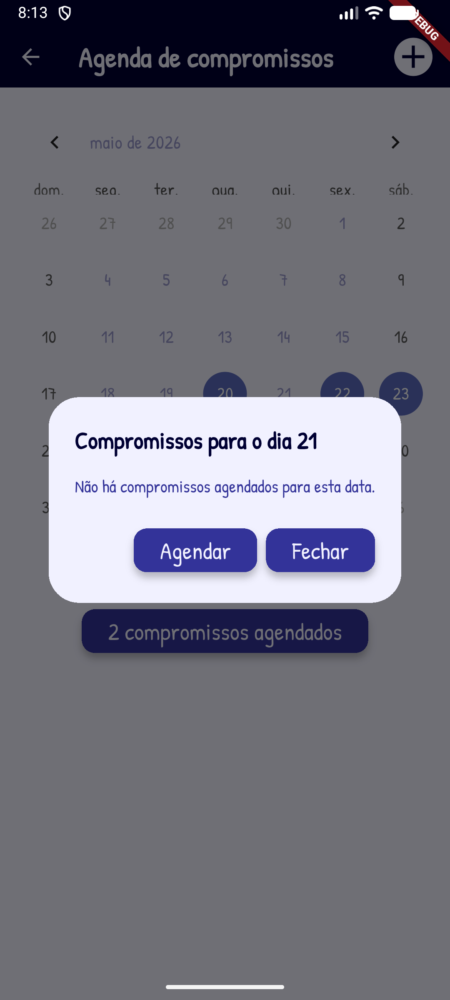
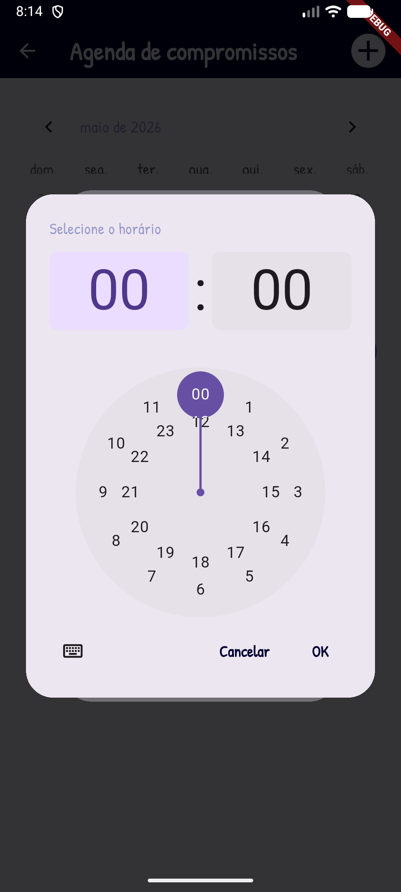

# Agenda
App simples em flutter de uma agenda de compromissos com armazeamento local em arquivo de texto csv, criado para estudos e aulas de programação Mobile.

- Funcionalidade CRUD com arquivo de texto CSV
- Converção de datas e calculos com datas
- TableCalendar
- DatePicker
- TimePicker

## Tecnologias
- Flutter
- VsCode
- Android Studio

|Temas|WidGets|
|-|:-:|
|Tavar aplicativo na vertical|WidgetsFlutterBinding.ensureInitialized() SystemChrome.setPreferredOrientations()|
|Tema|ThemeData.light().copyWith()|
|Imagens|Image.asset(), Icon()|
|Assincronicidade|async|
|Carregar e salvar dados em Arquivo local|path_provider|
|Conversão de dados, classe Model de MVC|CSV|
|Utilização de fontes de texto externas .ttf|assets/fonts|
|Botões de controle de conteúdos em tela|ElevatedButton()|
|Animação|Splash Screen, Transform.rotate e opacidade|
|Selecionar status do compromisso|DropdownButton()|
|Calendário mensal|TableCalendar()|
|Selecionar data|showDatePicker()|
|Selecionar hora|showTimePicker()|

## Para testar
- 1 Clone o repositório
- 2 Abra com VsCode, Abra o trminal **CTRL + "**, execute o comando `flutter pub get` para instalar as dependências
- 3 Navegue até o arquivo lib/main.dart e dê **play** ou execute o comando `flutter run` para rodar o projeto
- 4 Escolha navegador ou um emulador para testar, ou abra o arquivo */lib/main.dart* e clique em Play.

## Print das telas

|||
|:-:|:-:|
|Splash|Home com o TableCalendar|
|||
|||
|||
|||
|||
|||
|||

